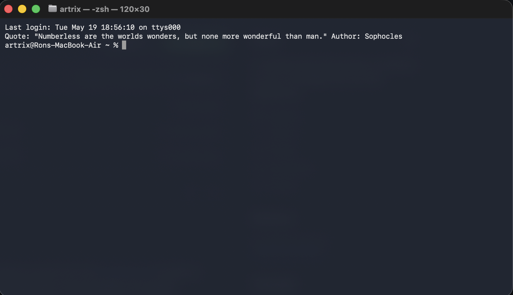
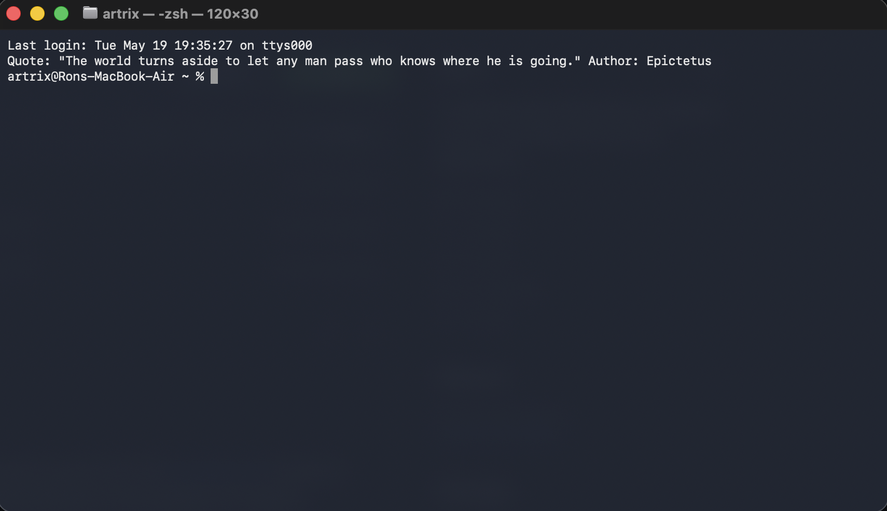

# Quotes-CLI 

Quotes-CLI is a easy to set-up Python coded quote that appears in your terminals start up that grabs a random quote from the [Quotable API](https://github.com/lukepeavey/quotable) Credits to Luke Peavey for the Quotable API and the amazing 12 Contributers contributing to the Quotable API project!

## Dependencies

```bash
pip3 install requests
```
## Get Started!
MUST HAVE DEPENDENCIES INSTALLED!
First clone the github repository with git.
```bash
git clone https://github.com/MidnightParadise295/QUOTES-CLI.git
```
CD into the directory 
```bash
cd QUOTES-CLI
```
Finally run the automatic installation and you are done! Open any Issues if something doesnt work for you and ill try to help!
```bash
python3 zshconfiguration.py
```
## Examples


 
### This Project is Licensed under the GNU open source License 

You can contribute and fork this repo and make your own version!
